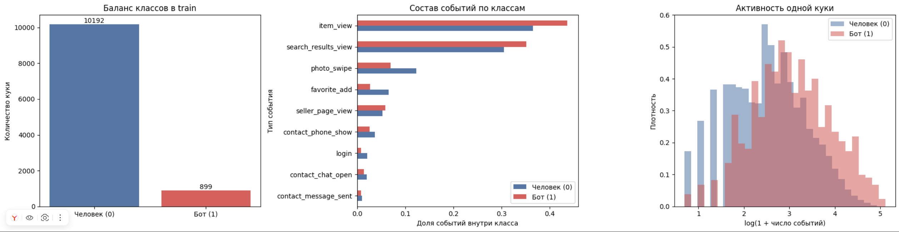

# Обнаружение автоматизированного трафика по событиям

Решение задачи классификации куки по суточной истории действий. Для каждой `cookie_id` модель выдаёт `score` от 0 до 1: чем выше значение, тем вероятнее автоматизированный сбор данных.

Весь код, включая подготовку данных, признаки, официальную метрику, валидацию и создание ответа, находится в [solution_avito.ipynb](solution_avito.ipynb). Данные в репозиторий не включены, используются файлы, выданные вместе с заданием.

1. Откройте `solution_avito.ipynb` в Google Colab. (Достаточно CPU; GPU не используется)
2. Создайте на Google Drive папку `MyDrive/bot_detection_challenge/data/` и поместите в неё `train.csv`, `test.csv`, `events.csv.gz`. Если файлы лежат в другом месте, измените переменную `PROJECT` в ячейке подключения Drive.
3. Запустите ячейки, для максимально точного повторения использовать Python 3.12
4. Готовый `submission.csv` будет сохранён и скачан последней ячейкой

В ноутбуке зафиксирован `SEED = 42`. Внешние API и большие языковые модели не используются.

Метки доступны для 11 091 обучающих куки, из них 899 относятся к положительному классу. В тесте 4 909 куки. Признаки строятся только из событий с `window_start_ts <= event_ts < window_end_ts`. После фильтрации полностью одинаковые записи событий учитываются один раз. Для каждой куки рассчитывается 141 признак: частоты действий, разнообразие объявлений, категорий, локаций и запросов, интервалы между событиями, интенсивность активности, характеристики курсора и обобщённые сведения о клиенте.

Пропуски отражаются отдельными показателями заполненности полей; оставшиеся отсутствующие числовые значения заменяются на `-1`. Категориальные поля преобразуются в числовые статистики, а идентификатор куки не используется как признак.

Основная модель — `CatBoostClassifier` с 700 итерациями, глубиной 6, скоростью обучения 0.045, `l2_leaf_reg=5` и `random_seed=42`. Baseline — `RandomForestClassifier` на числе событий и числе уникальных объявлений.

Валидация проводится по времени: обучение на ранних днях, оценка на более поздних. Используется официальная метрика **максимальная Precision среди порогов с Recall ≥ 70%**. Куки с одинаковым `score` оцениваются одной группой.

| Начало валидационного периода | Куки | Боты | Baseline | CatBoost |
| --- | ---: | ---: | ---: | ---: |
| 2026-04-14 | 4 318 | 355 | 0.0948 | 0.7733 |
| 2026-04-17 | 1 951 | 160 | 0.0931 | 0.8370 |

